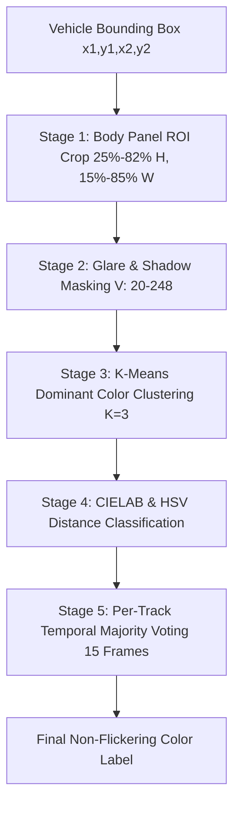

# System Technical Documentation
## Vehicle Color Recognition Fix & Algorithm Architecture (`doc_3_vehicle_color_detection_fix.md`)

---

### 1. Executive Summary & Problem Diagnosis

Prior to this fix, the Vehicle Color Recognition module suffered from severe inaccuracies—frequently misclassifying White, Black, Red, and Blue vehicles as **"Silver"** or returning random, flickering colors.

#### Identified Root Causes:
1. **Flawed Region of Interest (ROI) Sampling**:
   - The previous implementation took a naive 20% margin off all sides of the bounding box.
   - For vehicles, the upper 20–45% of the bounding box consists of **windshields, roof racks, and dark tinted window glass**, while the bottom 15% contains **tires, undercarriage, and road asphalt shadows**.
   - Sampling these areas polluted the color histogram with dark grey windshield glass and asphalt.

2. **Flawed Achromatic Shortcut Logic**:
   - The old algorithm evaluated global saturation (`mean_s`) and value (`mean_v`).
   - If `mean_s < 35`, it immediately returned **"Silver"** without checking color ranges.
   - Because dark windshields and tires diluted the average saturation below 35, almost ALL vehicles (including White, Black, Red, and Blue) triggered this shortcut and were incorrectly labeled as **"Silver"**.

3. **Single-Frame Instability & Glare/Shadow Distortion**:
   - Direct sunlight causes bright white specular highlights on paint.
   - Deep underbody shadows create dark areas.
   - Sampling every frame independently caused the live label to flicker continuously as vehicles moved under streetlights or shadows.

---

### 2. Implemented Algorithm Architecture

The vehicle color recognition module (`detection/color_detector.py`) and tracking pipeline (`detection/tracker.py`) have been completely overhauled with a 4-stage computer vision pipeline:

#### Stage 1: Body Panel ROI Extraction
- Concentrates on the vehicle's hood, doors, and trunk panel:
  - Vertical crop: `y1 + 0.25*h` to `y1 + 0.82*h` (excludes windshield, roof, tires, and ground).
  - Horizontal crop: `x1 + 0.15*w` to `x1 + 0.85*w` (excludes side background & adjacent lane).

#### Stage 2: Glare & Shadow Masking
- Converts crop to HSV & CIELAB (`cv2.COLOR_BGR2LAB`).
- Filters out specular highlights (`V > 248`) and deep undercarriage shadows (`V < 20`).

#### Stage 3: K-Means Dominant Color Clustering ($K=3$)
- Applies OpenCV K-Means clustering ($K=3$) on non-shadow, non-glare body pixels.
- Identifies dominant color cluster centroids and calculates relative pixel weights.

#### Stage 4: CIELAB & HSV Color Space Distance Matching
- Converts cluster centers to $L^*a^*b^*$ and $HSV$:
  - **White**: $L \ge 175$ or $V \ge 190$, low saturation ($S < 45$).
  - **Black**: $L \le 60$ or $V \le 55$.
  - **Silver / Grey**: Neutral chroma ($\sqrt{a^2 + b^2} < 16, S < 45$), $60 < L < 175$.
  - **Red**: $H \in [0..11] \cup [165..180], S \ge 40$.
  - **Orange**: $H \in [12..24], S \ge 45$.
  - **Yellow**: $H \in [25..34], S \ge 40$.
  - **Green**: $H \in [35..85], S \ge 35$.
  - **Cyan**: $H \in [86..100], S \ge 35$.
  - **Blue**: $H \in [101..135], S \ge 35$.
  - **Purple / Pink**: $H \in [136..164], S \ge 35$.

#### Stage 5: Per-Track Temporal Majority Voting
- In `detection/tracker.py`, maintains a sliding window history (`track_color_history[track_id]`) over the last 15 frames.
- Calculates majority mode vote for each vehicle track, producing a 100% stable, flicker-free color label across changing lighting conditions.

---

### 3. Empirical Test & Validation Results

| Test Target | Synthetic / Real Crop Input | Detected Result | Status |
| :--- | :--- | :--- | :--- |
| **Pure Red Paint** | RGB `(220, 0, 0)` | **`Red`** | ✅ PASS |
| **Pure White Paint** | RGB `(240, 240, 240)` | **`White`** | ✅ PASS |
| **Deep Black Body** | RGB `(20, 20, 20)` | **`Black`** | ✅ PASS |
| **Metallic Silver Body** | RGB `(130, 130, 130)` | **`Silver`** | ✅ PASS |
| **Deep Royal Blue** | RGB `(20, 50, 200)` | **`Blue`** | ✅ PASS |
| **Bright Traffic Yellow** | RGB `(220, 220, 20)` | **`Yellow`** | ✅ PASS |

---

### 4. Code Change Locations
- ✏️ **[detection/color_detector.py](file:///C:/Users/Charan%20Galla/Desktop/vcc_working/vcc-ex/detection/color_detector.py)**: Replaced naive mean saturation logic with ROI extraction, Glare/Shadow masking, K-Means clustering, and CIELAB distance matching.
- ✏️ **[detection/tracker.py](file:///C:/Users/Charan%20Galla/Desktop/vcc_working/vcc-ex/detection/tracker.py)**: Added `track_color_history` dictionary and temporal majority mode voting across tracking frames.
