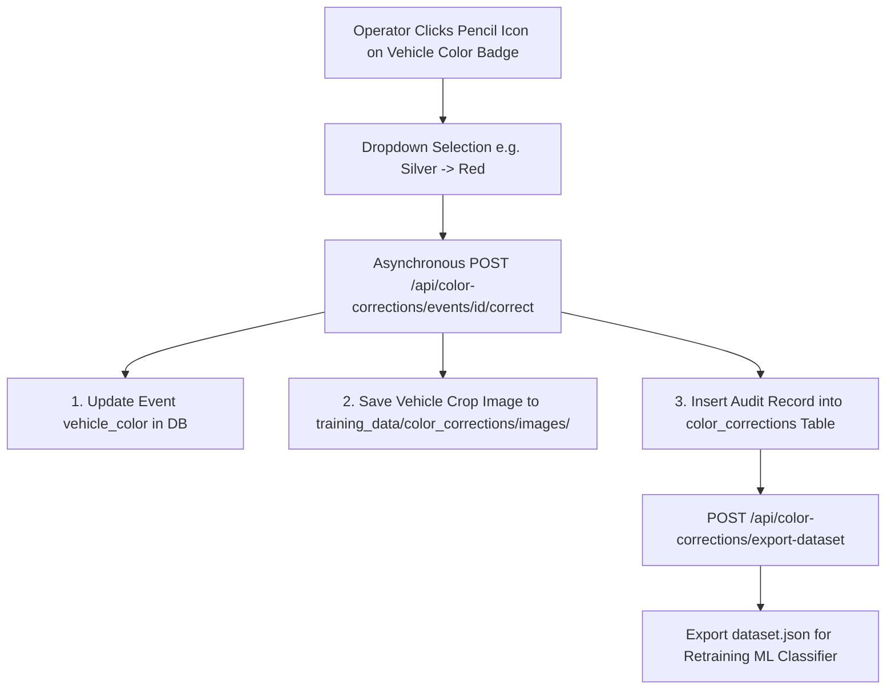

# System Technical Documentation
## Manual Vehicle Color Override & Dataset Retraining Architecture (`doc_5_manual_color_correction.md`)

---

### 1. Feature Overview & Architecture

The **Manual Color Correction / Override System** empowers operators to correct mislabeled vehicle colors directly within the web interface (Live View, Event Logs, and Training Studio) without interrupting live RTSP streams or counting workflows.

Every manual override performs three atomic actions:
1. **Live Database & UI Update**: Updates the target event's color tag in the database and broadcasts the change across active WebSocket clients.
2. **Crop Image Dataset Logging**: Saves a crop of the vehicle image (or reference crop) into a dedicated dataset directory: `backend/training_data/color_corrections/images/`.
3. **Audit & Retraining Logging**: Records a structured entry in the `color_corrections` table for historical accuracy analytics and dataset generation.



---

### 2. UI Component Integration (`EditableColorBadge.jsx`)

The frontend includes an interactive, reusable component: **`EditableColorBadge.jsx`**.

#### Features:
- **Visual Color Pill**: Displays color badges (e.g. `Red`, `Blue`, `White`, `Black`, `Yellow`, `Silver`) with a subtle hover effect and edit icon (`Pencil`).
- **One-Click Quick Select Menu**: Opens a non-blocking dropdown listing 12 predefined vehicle paint colors plus a custom write-in input box.
- **Asynchronous Non-Disruptive Submission**: Dispatches a background HTTP `POST` request without pausing video streams or reloading the page.

---

### 3. Database Schema (`color_corrections`)

The system introduces the `ColorCorrection` ORM model in `backend/models.py`:

```python
class ColorCorrection(Base):
    __tablename__ = "color_corrections"

    id = Column(Integer, primary_key=True, index=True)
    event_id = Column(BigInteger().with_variant(Integer, "sqlite"), ForeignKey("events.id", ondelete="SET NULL"), nullable=True)
    camera_id = Column(Integer, ForeignKey("cameras.id", ondelete="CASCADE"), nullable=True)
    vehicle_class = Column(String(32), nullable=False, default="car")
    original_color = Column(String(32), nullable=False)
    corrected_color = Column(String(32), nullable=False)
    crop_image_path = Column(String(512), nullable=True)
    user_email = Column(String(320), nullable=True)
    notes = Column(String(255), nullable=True)
    timestamp = Column(UtcDateTime, nullable=False, server_default=func.now())
```

---

### 4. REST API Endpoint Specifications

| Method | Endpoint | Description |
| :--- | :--- | :--- |
| `POST` | `/api/color-corrections/events/{event_id}/correct` | Submits a manual color correction for `event_id`, updates DB, saves crop image, and logs override. |
| `GET` | `/api/color-corrections` | Returns paginated list of all verified manual color overrides. |
| `GET` | `/api/color-corrections/stats` | Returns mislabel statistics and original vs corrected color confusion matrix. |
| `POST` | `/api/color-corrections/export-dataset` | Generates `training_data/color_corrections/dataset.json` manifest for retraining ML color classifiers. |

---

### 5. Dataset Export & Retraining Workflow

To improve the automatic color detection module over time:

1. **Dataset Export**: Trigger `POST /api/color-corrections/export-dataset` from the UI or API.
2. **Manifest Generation**: Generates `backend/training_data/color_corrections/dataset.json`:
   ```json
   {
     "dataset_version": "1.0",
     "sample_count": 142,
     "samples": [
       {
         "id": 1,
         "event_id": 842,
         "vehicle_class": "car",
         "original_color": "Silver",
         "corrected_color": "Red",
         "crop_path": "color_corrections/images/crop_event_842.jpg",
         "timestamp": "2026-07-23T00:15:00Z"
       }
     ]
   }
   ```
3. **Model Fine-Tuning**: Feed the exported labeled crop images into a ResNet18 / EfficientNet color classifier or use them to calibrate CIELAB color distance thresholds.

---

### 📄 Code Locations
- ✏️ **[backend/models.py](file:///C:/Users/Charan%20Galla/Desktop/vcc_working/vcc-ex/backend/models.py)**: Added `ColorCorrection` table schema.
- ✏️ **[backend/routers/color_corrections.py](file:///C:/Users/Charan%20Galla/Desktop/vcc_working/vcc-ex/backend/routers/color_corrections.py)**: Implemented override logging, statistics, and dataset export endpoints.
- ✏️ **[frontend/src/components/EditableColorBadge.jsx](file:///C:/Users/Charan%20Galla/Desktop/vcc_working/vcc-ex/frontend/src/components/EditableColorBadge.jsx)**: Reusable UI color correction badge component.
- ✏️ **[frontend/src/components/ColorCorrectionsGallery.jsx](file:///C:/Users/Charan%20Galla/Desktop/vcc_working/vcc-ex/frontend/src/components/ColorCorrectionsGallery.jsx)**: Training Studio gallery for reviewing overrides and exporting dataset manifests.
