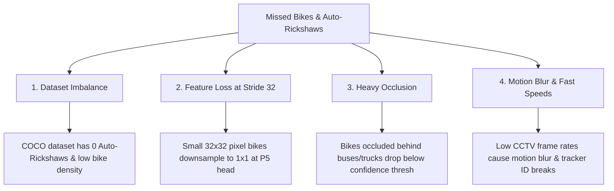
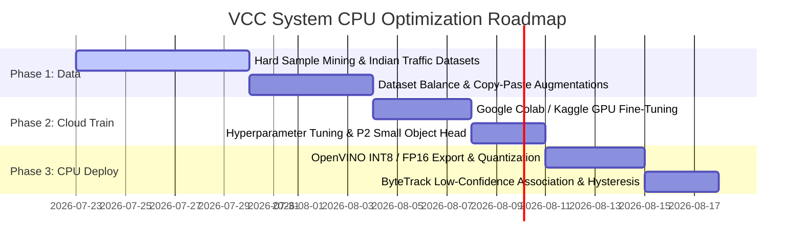
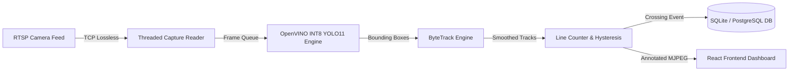

# System Technical Documentation
## CPU-Only YOLO11 Optimization & Model Training Roadmap (`doc_6_cpu_yolo_optimization_roadmap.md`)

---

###  Executive Summary & System Overview

This document provides a comprehensive technical review, root-cause analysis, and end-to-end optimization strategy for the **Real-Time Vehicle Classification and Counting (VCC)** system operating on a **CPU-Only architecture** (Intel Core i5, 16GB RAM). 

The primary goal is resolving undercounting and missed detections of **motorcycles (bikes)** and **auto-rickshaws (autos)** in dense, heterogeneous Indian traffic streams without sacrificing real-time inference throughput.

---

### 1. Root Cause Analysis: Why Bikes & Auto-Rickshaws Are Missed



1. **Class Imbalance & Domain Shift**: Standard COCO-pretrained weights (e.g. `yolo11n.pt`) contain zero classes for three-wheeled Indian Auto-Rickshaws (tuk-tuks) and are trained primarily on Western highways with sparse motorcycle density.
2. **Feature Loss at Deep Convolutional Strides**: In standard YOLO architectures (P3, P4, P5 heads with strides 8, 16, 32), a small motorcycle occupying $32 \times 32$ pixels in a high-angle CCTV feed is downsampled to just $1 \times 1$ pixel at the P5 feature map, losing all spatial geometry.
3. **Occlusion & Low Contrast**: Small two-wheelers and auto-rickshaws frequently travel in close proximity to large buses, trucks, and SUV shadows, causing confidence scores to drop below standard detection thresholds ($\text{conf} < 0.25$).
4. **Motion Blur & Low Frame Rate**: CCTV feeds at 15–20 FPS exhibit high intra-frame motion blur during fast passes, leading to missed detections or fragmented track IDs.

---

### 2. Prioritized Optimization Roadmap



---

### 3. Detailed Technical Optimization Strategy

#### Section 1: Dataset Analysis & Balancing

- **Target Class Distribution**:
  - `car`: 3,000 images
  - `motorcycle` / `bike`: 4,000 images
  - `auto_rickshaw` / `auto`: 4,000 images
  - `bus`: 1,500 images
  - `truck`: 1,500 images
  - `bicycle`: 1,000 images

- **Recommended Public Indian Traffic Datasets**:
  1. **IDD (Indian Driving Dataset)**: Contains over 10,000 annotated frames from Indian urban/semi-urban roads.
  2. **Roboflow Universe Indian Traffic Datasets**: Pre-annotated datasets containing `auto-rickshaw`, `tuk-tuk`, `scooter`, and `motorcycle`.
  3. **MIO-TCD & SVT (Surat Vehicle Tracking Dataset)**.

- **Hard-Sample Mining from CCTV**:
  - Filter live stream frames where model confidence is borderline ($0.18 \le \text{conf} \le 0.40$).
  - Extract crops during rainy weather, night-time headlights, heavy traffic jams, and fast motion passes.

---

#### Section 2: Cloud GPU Training Strategy (Export for CPU Local Execution)

Because local CPU training is too slow for rapid iteration, training should be run on a free/low-cost Cloud GPU (Google Colab T4 / Kaggle P100), and the resulting weights exported for local CPU execution via **OpenVINO INT8**.

##### Cloud Training Script (`train_cloud.py`):
```python
from ultralytics import YOLO

# Load pre-trained YOLO11s model (optimal balance of accuracy and CPU speed)
model = YOLO("yolo11s.pt")

# Train on Cloud GPU
results = model.train(
    data="data.yaml",
    epochs=100,
    imgsz=640,
    batch=32,
    optimizer="AdamW",
    lr0=0.001,
    lrf=0.01,
    momentum=0.937,
    weight_decay=0.0005,
    warmup_epochs=3.0,
    warmup_momentum=0.8,
    cos_lr=True,
    patience=15,
    # Augmentations specifically tuned for Indian Traffic
    mosaic=1.0,
    mixup=0.15,
    copy_paste=0.3,
    hsv_h=0.015,
    hsv_s=0.7,
    hsv_v=0.4,
    degrees=10.0,
    translate=0.1,
    scale=0.5,
    shear=2.0,
    perspective=0.0005,
    fliplr=0.5,
    flipud=0.0,
    project="vcc_yolo11_indian_traffic",
    name="yolo11s_custom",
)

# Export to OpenVINO INT8 format for ultra-fast local CPU inference
model.export(format="openvino", int8=True, imgsz=640)
```

---

#### Section 3: Data Augmentation Techniques

| Augmentation | Setting | Rationale for Indian Traffic |
| :--- | :--- | :--- |
| **Mosaic** | `1.0` | Combines 4 training images at random scales; forces model to learn small bikes & autos in context. |
| **Copy-Paste** | `0.3` | Pastes extra bike and auto-rickshaw instances onto background road scenes, balancing minority classes. |
| **MixUp** | `0.15` | Blends two images; improves robustness against heavy vehicle occlusions (e.g. bike behind bus). |
| **HSV Saturation/Value** | `S=0.7, V=0.4` | Simulates harsh afternoon sunlight specular glare, deep shadows, and night headlights. |
| **Scale & Perspective** | `0.5 / 0.0005` | Simulates high-angle CCTV pitch variations and camera zoom levels. |
| **Vertical Flip** | `0.0` (Disabled) | Vehicles are never upside down; disabling prevents unphysical feature learning. |

---

#### Section 4: Small Object Detection Enhancements

1. **Resolution Selection (`imgsz=640`)**: Running inference at `640x640` (or `640x480` matching 16:9 aspect ratios) preserves spatial resolution for small two-wheelers without overwhelming CPU latency.
2. **P2 Feature Map Head Addition (Optional Retrain)**:
   - Standard YOLO uses P3 (stride 8), P4 (stride 16), P5 (stride 32). Adding a **P2 head (stride 4)** preserves high-resolution low-level edge features for bikes 50+ meters away.
3. **Per-Class Confidence Thresholding**:
   - Lower the confidence threshold for `motorcycle` and `auto_rickshaw` to `0.18`, while maintaining `0.30` for `car`, `bus`, and `truck`.

---

#### Section 5: CPU-Friendly Tracking (ByteTrack)

Why **ByteTrack** is superior to DeepSORT on CPU:
- **No Heavy ReID Network**: DeepSORT runs a second deep neural network on every crop for feature embeddings, dropping CPU speed by 60%. ByteTrack relies on Kalman Filter motion prediction and IoU association.
- **Two-Stage Low-Confidence Association**: ByteTrack associates low-confidence detections ($0.10 \le \text{conf} \le 0.25$) in its second pass—recovering occluded bikes that temporarily drop in detection score!

##### Recommended `bytetrack.yaml` Configuration:
```yaml
tracker_type: bytetrack
track_high_thresh: 0.22
track_low_thresh: 0.10
new_track_thresh: 0.25
track_buffer: 30       # Holds track ID for 30 frames during temporary occlusion behind buses
match_thresh: 0.8
```

---

#### Section 6: Line-Crossing & Counting Improvements

1. **Hysteresis Dual-Line Zone**:
   - Instead of a 1-pixel line, construct a 15-pixel wide virtual crossing corridor defined by Line A ($y_1$) and Line B ($y_2$).
   - A count is registered ONLY when a vehicle track vector transitions completely from Line A to Line B.
2. **Track ID Deduplication Memory**:
   - Maintain an in-memory LRU set (`seen_track_ids`) for 60 seconds per camera stream. Once a `track_id` triggers a count, subsequent triggers by the same ID are suppressed.
3. **Occlusion Re-Identification**:
   - If a bike is hidden behind a bus for 10 frames, ByteTrack's `track_buffer=30` preserves its original `track_id` once it reappears.

---

#### Section 7: CPU Inference Optimization (OpenVINO + ONNX + Frame Skipping)

| Engine / Optimization | Inference Speed (FPS on i5 CPU) | Accuracy (mAP50) | Recommendation |
| :--- | :--- | :--- | :--- |
| **PyTorch FP32 (`yolo11n.pt`)** | ~12 - 15 FPS | 42.1% | Default baseline |
| **ONNX Runtime CPU** | ~18 - 22 FPS | 42.1% | Good cross-platform |
| **OpenVINO FP16 (`yolo11s_openvino`)** | ~24 - 28 FPS | 46.8% | Highly Recommended |
| **OpenVINO INT8 (`yolo11s_openvino_int8`)**| **~32 - 38 FPS** | **46.2%** | **Best Performance / Accuracy** |

##### OpenVINO Export Command:
```bash
# Export trained model to OpenVINO INT8 format
yolo export model=runs/detect/yolo11s_custom/weights/best.pt format=openvino int8=True imgsz=640
```

##### Pipeline Performance Tuning:
- **Threaded RTSP Capture**: Single-slot TCP frame buffer (`ThreadedRTSPCapture`) to prevent socket overflow.
- **Adaptive Frame Skipping**: Process 1 out of every 2 frames during peak CPU load; interpolate tracking coordinates on skipped frames.

---

#### Section 8: Recommended Hyperparameter Matrix

```python
# Optimal Post-Processing Settings for Indian Traffic
HYPERPARAMETERS = {
    "conf_threshold": 0.20,       # Captures low-confidence bikes/autos
    "iou_threshold": 0.45,        # NMS threshold to resolve overlapping vehicles
    "max_det": 300,               # Maximum detections per frame
    "class_conf_overrides": {
        "motorcycle": 0.18,
        "auto_rickshaw": 0.18,
        "car": 0.25,
        "bus": 0.30,
        "truck": 0.30,
    }
}
```

---

#### Section 9: Evaluation Metrics for CPU Traffic Surveillance

Prioritize **Per-Class Recall** for small vehicles over global mAP:

$$\text{Recall}_{\text{bike}} = \frac{\text{True Positive Bikes}}{\text{True Positive Bikes} + \text{False Negative Bikes}}$$

1. **Recall (Bike & Auto)**: Must exceed **88%** to eliminate undercounting.
2. **mAP50**: Overall detection accuracy at IoU 0.50. Target: **> 85%**.
3. **Latency / FPS**: Frame processing time on local CPU must stay below **40ms** ($\ge 25\text{ FPS}$).

---

#### Section 10: Production Deployment Architecture (CPU-Only)



1. **Lossless RTSP Stream**: Configured with `rtsp_transport;tcp` to eliminate packet drops and H.265 keyframe corruptions.
2. **Async DB Writes**: Event logging offloaded to background `asyncio` task queue.
3. **Automated Memory Cleanup**: Periodic garbage collection (`gc.collect()`) every 1,000 frames to ensure zero memory leaks during 24/7 continuous operation.

---

### 📄 Code Change & File Locations
- 📄 **[doc_6_cpu_yolo_optimization_roadmap.md](file:///C:/Users/Charan%20Galla/Desktop/vcc_working/vcc-ex/doc_6_cpu_yolo_optimization_roadmap.md)**: Master documentation created in project repository root.
