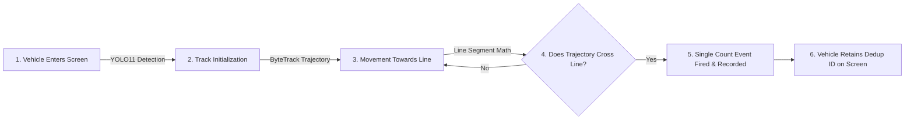
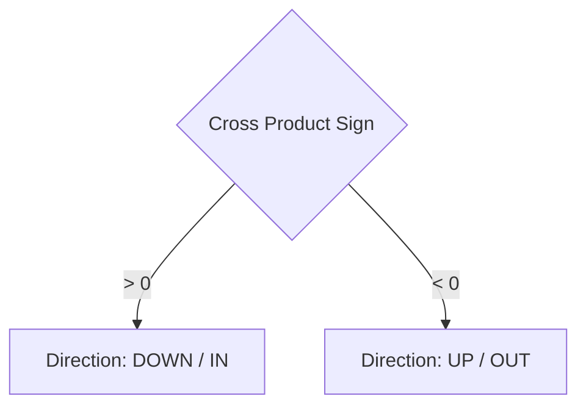

# System Technical Documentation
## Vehicle Counting & Virtual Line-Crossing Mechanism (`doc_7_vehicle_counting_line_crossing_mechanism.md`)

---

### 1. Executive Summary

In the **Vehicle Classification and Counting (VCC)** system, vehicle counts are **NOT** triggered immediately upon detection (when a bounding box first appears on screen). 

Counting occurs **exclusively when a vehicle's tracked centroid trajectory physically crosses a user-defined virtual counting line**.



---

### 2. Complete Technical Pipeline

```mermaid
sequenceDiagram
    autonumber
    participant Cam as CCTV RTSP Stream
    participant YOLO as YOLO11 Detector
    participant BT as ByteTrack Tracker
    participant LC as LineCounter (counter.py)
    participant DB as SQLite / Event API

    Cam->>YOLO: Frame N (RTSP Video Stream)
    YOLO->>BT: Bounding Boxes [x1, y1, x2, y2, conf, class]
    BT->>LC: Track Objects [track_id, bbox, centroid(cx, cy)]
    
    rect rgb(20, 30, 50)
        note over LC: Evaluate Trajectory vs Virtual Line AB
        LC->>LC: Record Class & Color Votes for track_id
        LC->>LC: Calculate Segment CD: (prev_cx, prev_y) -> (curr_cx, curr_y)
        LC->>LC: Check Segment Intersection: intersect(AB, CD)
    end

    alt Segment CD Intersects Line AB & track_id not in Dedup Set
        LC->>LC: Determine Direction via Vector Cross Product
        LC->>LC: Resolve Class & Color via Lifetime Majority Vote
        LC->>LC: Add track_id to Line Dedup Set
        LC->>DB: Fire CrossingEvent (Async WebSocket & DB Insert)
    else No Intersection or Already Counted
        LC->>LC: Update prev_centroid = (curr_cx, curr_y)
    end
```



---

### 3. Geometric Line-Crossing Detection Algorithm

The line-crossing logic in `detection/counter.py` relies on 2D computational geometry:

#### A. Definitions
- **User-Defined Counting Line ($AB$)**:
  Point $A(x_1, y_1)$ to Point $B(x_2, y_2)$, converted from normalized coordinates $[0.0, 1.0]$ to pixel dimensions $(w, h)$.
- **Vehicle Trajectory Segment ($CD$)**:
  - $C(prev\_x, prev\_y)$: Centroid of vehicle in frame $N-1$.
  - $D(curr\_x, curr\_y)$: Centroid of vehicle in frame $N$.

```
     Frame N-1 (C)
         \
          \   Trajectory Segment CD
           \
   A========X================B  <-- Virtual Counting Line AB
             \
              \
            Frame N (D)
```

#### B. Segment Intersection Math (`intersect(A, B, C, D)`)
Two line segments $AB$ and $CD$ intersect if and only if:
1. Points $A$ and $B$ are separated by line segment $CD$.
2. Points $C$ and $D$ are separated by line segment $AB$.

This is evaluated in $O(1)$ time per line using the Counter-Clockwise (`ccw`) orientation test:

$$\text{ccw}(P_1, P_2, P_3) = (P_3.y - P_1.y) \times (P_2.x - P_1.x) > (P_2.y - P_1.y) \times (P_3.x - P_1.x)$$

$$\text{intersect}(A, B, C, D) = \Big(\text{ccw}(A,C,D) \neq \text{ccw}(B,C,D)\Big) \;\land\; \Big(\text{ccw}(A,B,C) \neq \text{ccw}(A,B,D)\Big)$$

---

### 4. Direction Determination (Vector Cross Product)

Once an intersection between segment $CD$ and segment $AB$ is confirmed, the crossing direction is determined using 2D vector cross product mathematics:

$$\text{Cross Product} = (B_x - A_x) \times (D_y - C_y) - (B_y - A_y) \times (D_x - C_x)$$



- **If Cross Product $> 0$**: The vehicle moved **DOWN / IN** across line $AB$.
- **If Cross Product $< 0$**: The vehicle moved **UP / OUT** across line $AB$.

If the line direction constraint matches (e.g., `direction="down"` or `direction="both"`), and `track_id` has not been registered yet, the count is recorded.

---

### 5. Temporal Majority Voting for Vehicle Class & Color

A common issue with raw single-frame detection is **YOLO class flickering** (e.g., a vehicle detected as `car` in frame 1, `bus` in frame 2, and `car` in frame 3).

To guarantee strict accuracy:
1. **Vote Accumulation**: Every single frame a vehicle is tracked, `LineCounter` accumulates class confidence votes and color predictions:
   $$\text{Vote}(c) = \sum \text{confidence}_c$$
2. **Lifetime Winner Resolution**: At the exact moment of line crossing, the system selects the class and color with the highest cumulative score across the vehicle's entire visible lifetime.

---

### 6. Memory Safety & Deduplication

To prevent duplicate counts and memory leaks during long-running CCTV monitoring:

1. **In-Flight Deduplication**:
   - Each counting line maintains independent sets: `counted_down_per_line` and `counted_up_per_line`.
   - A vehicle's `track_id` is added immediately upon crossing. Subsequent crossings by the same active track are ignored.

2. **Track Retirement**:
   - When a vehicle exits the screen, its missing frame counter increments.
   - After `retire_after_frames` (default: 30 consecutive missing frames), all cached centroids, class votes, and dedup IDs for that track are evicted.
   - This ensures memory remains bounded and ByteTrack ID recycling does not produce phantom counts.

---

### 📄 Code Locations & File References
- ⚙️ **[detection/counter.py](file:///C:/Users/Charan%20Galla/Desktop/vcc_working/vcc-ex/detection/counter.py#L265-L360)**: Core `LineCounter`, `intersect()`, `ccw()`, and `process_tracks()` implementations.
- ⚙️ **[detection/tracker.py](file:///C:/Users/Charan%20Galla/Desktop/vcc_working/vcc-ex/detection/tracker.py)**: ByteTrack object tracking and centroid association.
- ⚙️ **[backend/routers/counting_lines.py](file:///C:/Users/Charan%20Galla/Desktop/vcc_working/vcc-ex/backend/routers/counting_lines.py)**: REST API endpoints for user line configuration.
